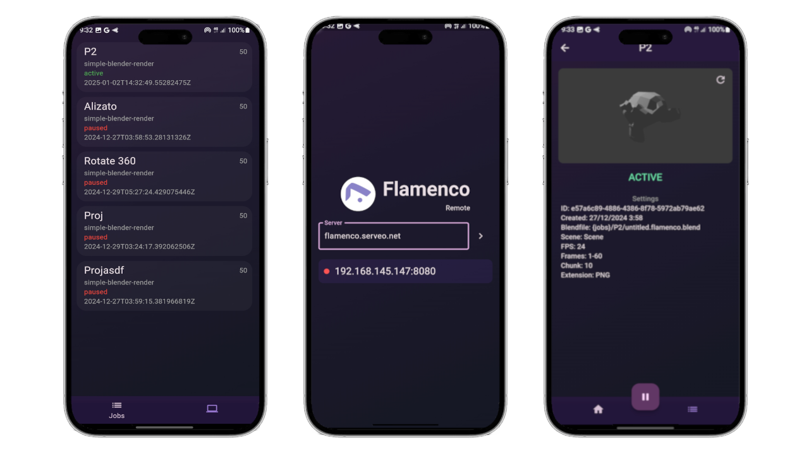

# Flamenco Remote 
Aplication of render farm managment based on Flamenco. Designed primarily for freelancers to be able to go out for coffee and see the progress of their renders at any time from anywhere on their mobile.

# Features
- Connect to server
- Remember last servers connections
- Show jobs
- Show workers
- Show info of Jobs
- Show tasks
- Preview last rendered
